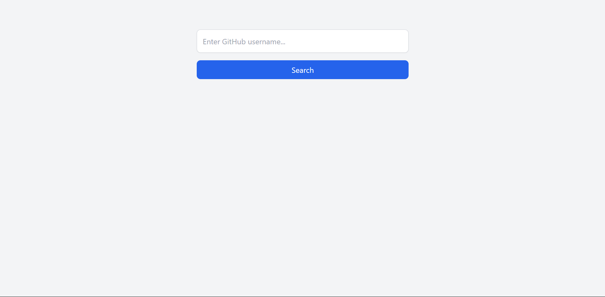

# 🔍 GitHub User Finder

A simple and clean web application that allows users to search for any GitHub profile using the GitHub REST API. It displays real-time profile data in a responsive and modern UI built with Tailwind CSS.

---

## 📸 Preview



---

## 🚀 Live Demo

👉 [Click Here to View Live Project](https://github-finder-taupe-mu-59.vercel.app/)

---

## ✨ Features

-  Search GitHub profiles by username  
-  Displays profile photo, name, bio, location, and company  
-  Shows followers, following, repositories, and public gists  
-  Links to GitHub profile and repositories  
-  Input validation with user-friendly error messages  
-  Handles invalid usernames and API errors using `try...catch`  

---

##  Technologies Used

-  HTML5  
-  JavaScript (ES6+)  
-  Tailwind CSS  
-  GitHub REST API  

---

##  How It Works

###  1. Input & Validation

When a user types a username and clicks search, the JavaScript function validates the input. If it's empty, a numeric value, or less than two characters, it shows an appropriate error message.
---

```js
async function getUserData(username) {
  try {
    const response = await fetch(`https://api.github.com/users/${username}`);
    
    if (!response.ok) {
      main.innerHTML = "No user found";
      return;
    }

    const data = await response.json();
   
  } catch (error) {
    main.innerHTML = "Something went wrong.";
    console.error(error);
  }
}

btn.addEventListener("click", () => {
  usernameValue = username.value.trim();
  
  if (!usernameValue) {
    errorSms.innerHTML = "This field is required";
  } else if (!isNaN(usernameValue)) {
    errorSms.innerHTML = "Please enter a valid username";
  } else if (usernameValue.length < 2) {
    errorSms.innerHTML = "Please enter at least 2 characters";
  } else {
    errorSms.innerHTML = "";
    getUserData(usernameValue);
  }
});
